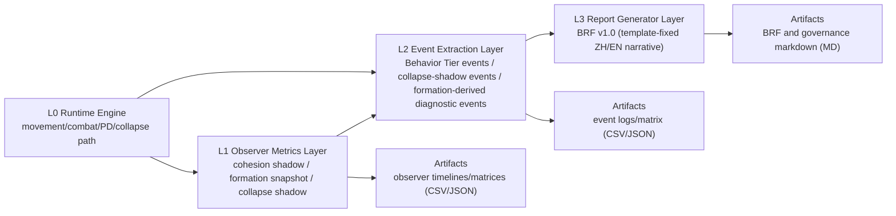
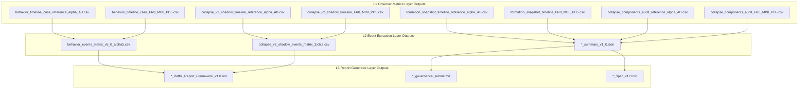

# LOGH Analytical Stack Architecture v1.0

Engine Version Reference: v5.0-alpha5  
Baseline Anchor: Current Phase V observer stack (Behavior Event Layer + Formation Snapshot Layer + BRF v1.0 template)  
Scope: Observer/reporting architecture documentation only (no runtime behavior change)

## 1. Executive Summary
This analytical stack is a post-runtime observation and reporting pipeline.  
It translates deterministic runtime states into observer metrics, extracts event-level signals, and generates human-readable battle reports under a fixed BRF template contract.

This stack is **not** a runtime decision path.  
It does not modify movement, combat, PD, or collapse runtime logic, and it does not allow observer metrics to directly rewrite BRF structure.

Core contract:
1. L0 computes battlefield behavior.
2. L1 computes observer metrics.
3. L2 promotes selected signals into event outputs.
4. L3 renders BRF using fixed template sections and timeline schema.

## 2. Canonical Layers
### L0 Runtime Engine
Responsibilities:
1. Execute movement/combat/PD/collapse runtime path.
2. Produce deterministic per-tick battlefield states.

Non-responsibilities:
1. No BRF narrative generation.
2. No governance report formatting.

### L1 Observer Metrics Layer
Responsibilities:
1. Compute observer-only metrics (cohesion shadow, formation snapshot metrics, collapse shadow metrics).
2. Export diagnostic timelines/matrices for audit.

Non-responsibilities:
1. Must not change L0 behavior.
2. Must not alter BRF template structure.

### L2 Event Extraction Layer
Responsibilities:
1. Convert metrics/state into event candidates and tiered events.
2. Produce event outputs for reporting consumption.

Non-responsibilities:
1. Must not mutate L0 runtime state.
2. Must not bypass BRF contract by injecting raw metrics directly into narrative structure.

### L3 Report Generator Layer
Responsibilities:
1. Generate BRF v1.0 report with fixed ZH/EN template sections (`3.1 Archetypes`, `3.2 ZH Narrative`, `3.3 EN Narrative`).
2. Consume event outputs and approved metadata only.

Non-responsibilities:
1. Must not add/remove BRF sections or Operational Timeline rows.
2. Must not read L0 internals in a way that skips L2 event contract.

### Artifacts
Responsibilities:
1. Persist audit-friendly CSV/JSON/MD outputs.
2. Preserve reproducible traceability between layer outputs.

## 3. High-Level Layer Diagram

## 4. Data Flow and Contracts
| Layer | Inputs | Outputs | Downstream Consumers |
| --- | --- | --- | --- |
| L0 Runtime Engine | Scenario settings, archetypes, engine code path | Per-tick state evolution | L1, L2 |
| L1 Observer Metrics Layer | L0 per-tick states | Observer metrics timelines/matrices | L2, Artifacts |
| L2 Event Extraction Layer | L0 states + L1 metrics | Event outputs (tier events, collapse/formation diagnostic events) | L3, Artifacts |
| L3 Report Generator Layer | L2 event outputs + fixed BRF template | BRF narrative/report files | Artifacts |

Observer -> Events -> BRF contract:
1. Observer layers may generate metrics and event candidates.
2. Only event outputs feed BRF timeline/narrative assembly.
3. Raw observer metrics are diagnostic metadata, not BRF schema modifiers.

## 5. Data Contract Diagram (Files by Layer)

## 6. Boundary Rules (No-Coupling Rules)
1. L1 must not change runtime behavior or feed runtime control switches.
2. L2 must not write back into L0 state or alter runtime parameter semantics.
3. L3 must not bypass template contract by adding/removing BRF section headings.
4. Formation Snapshot outputs remain diagnostic metadata unless explicitly promoted as events in L2.
5. BRF Operational Timeline table row set is locked by BRF v1.0 template.

## 7. Tick Semantics Normalization Rule
1. `t=0` is initial snapshot/state only.
2. First-occurrence event detection is computed only on `t>=1`.
3. BRF timeline values must represent event ticks with `t>=1`.

## 8. BRF v1.0 Template Protection Rule
1. Section headings and order are fixed by `analysis/engineering_reports/_standards/Battle_Report_Framework_v1.0.template.md`.
2. Operational Timeline table schema is fixed; no additional rows/columns.
3. Observer metrics cannot directly alter BRF structure.
4. Any future BRF schema change requires explicit governance directive and separate versioning.
