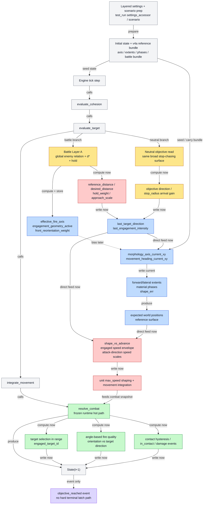
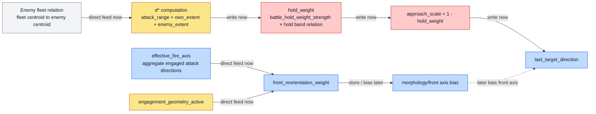
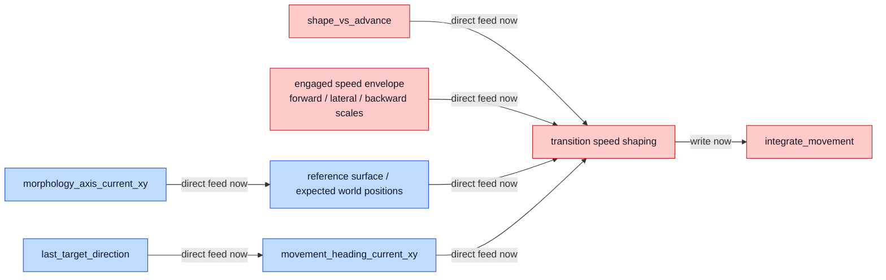
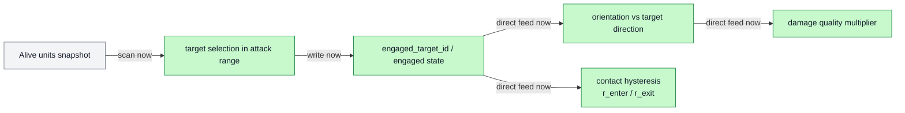

# v4a Current Mechanism Flow

Version scope: current PR `#6` local `v4a` line as of 2026-04-03  
Carrier: Markdown + Mermaid  
Purpose: Human-readable flow diagram of the current `v4a` mechanism surface  
Non-scope: diagnosis, repair proposal, merge claim, default-switch claim

---

## 0. Reading Guide

This document describes the **current** `v4a` mechanism flow only.

It intentionally does **not** judge whether a step is correct or incorrect.
It only shows:

- what currently owns which stage
- how signals move between stages
- where current battle / formation / terminal / combat paths branch

Color coding follows the current five discontinuity classes, but is used here
only as a **classification legend**, not as a quality judgment.

### Color Legend

- Class A: Owner / State
- Class B: Reference / Axis
- Class C: Force / Speed-Envelope
- Class D: Targeting / Combat
- Class E: Terminal / Settle
- Neutral gray: shared plumbing / data handoff

### Arrow Legend

To avoid ambiguity, the diagrams use three arrow meanings:

- `-->|stage / calls|`  
  stage progression or same-tick function call order

- `-->|write now / direct feed|`  
  direct state write or direct current-stage data feed

- `-.->|store / bias later|`  
  indirect influence:
  computed now, stored in bundle/state, consumed later by another stage

---

## 1. Top-Level v4a Flow

---

## 2. Battle-Side Flow Detail

---

## 3. Movement / Formation Realization Detail

---

## 4. Combat / Targeting / Damage Detail

---

## 5. Neutral Validation Surface

```mermaid
flowchart LR

    OBJ["Fixture objective anchor"]:::shared -->|direct feed now| ARR["arrival gain / stop_radius relation"]:::A
    ARR -->|write now| TD["last_target_direction"]:::B
    TD -->|direct feed now| AX["morphology axis / reference surface / movement shaping"]:::B
    AX -->|event only| REACH["objective_reached event<br/>no hard terminal latch"]:::E

    classDef shared fill:#f3f4f6,stroke:#6b7280,color:#111827,stroke-width:1px;
    classDef A fill:#fde68a,stroke:#b45309,color:#111827,stroke-width:1px;
    classDef B fill:#bfdbfe,stroke:#1d4ed8,color:#111827,stroke-width:1px;
    classDef E fill:#ddd6fe,stroke:#7c3aed,color:#111827,stroke-width:1px;
```

---

## 6. Current Active Observability Surface

Current Human-readable observation for this line is centered on:

- fleet-centroid trajectory
- alive-unit body observation
- 3D HUD battle-focused debug rows such as:
  - `Kinetics: v / h`
  - `eng_act`
  - `front_rw`
  - `fire_da`

These are observation surfaces only.
They are not runtime owners by themselves.
