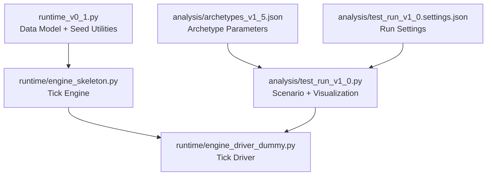
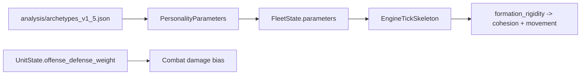

# Fleet Sandbox Runtime Report (Human-Readable)

Version scope: runtime implementation up to `v4.0` (targeting refactor, behavior-preserving)

## 0. Document Carrier and Assumptions

- Carrier: `Markdown` (`.md`)
- Diagram format: `Mermaid`
- Math format: LaTeX-style notation in Markdown

Assumptions:
1. Reader uses IDE/renderer supporting Mermaid in Markdown preview.
2. Reader accepts LaTeX-style inline/block formulas as the primary mathematical notation.

---

## 1. Simulation Architecture

### 1.1 Module-Level Structure



### 1.2 Runtime Data Objects

- `PersonalityParameters`: 10 canonical dimensions, raw domain \([1,10]\)
- `UnitState`: position, velocity, HP, speed, ODW runtime weight, orientation
- `FleetState`: fleet id + parameter bundle + unit membership
- `BattleState`: tick state container
  - `units`, `fleets`
  - `last_fleet_cohesion`
  - `last_target_direction`
  - `last_engagement_intensity`

### 1.3 Tick Pipeline (Engine Flow)

```mermaid
flowchart LR
    S[State(t)] --> T[Tick +1 Snapshot]
    T --> C1[evaluate_cohesion]
    C1 --> C2[evaluate_target]
    C2 --> C3[evaluate_utility]
    C3 --> C4[integrate_movement]
    C4 --> C5[resolve_combat]
    C5 --> N[State(t+1)]
```

Execution order in `EngineTickSkeleton.step`:
1. Tick increment snapshot (`tick = tick + 1`)
2. Cohesion update
3. Fleet target-direction update
4. Utility hook (identity at current version)
5. Movement integration + spacing projection
6. Combat resolution (snapshot-based, simultaneous writeback)

---

## 2. Simulation Mechanisms and Mathematical Expressions

### 2.1 Parameter Normalization

For any archetype raw parameter \(x \in [1,10]\):

\[
\hat{x} = \frac{x - 1}{9}, \quad \hat{x} \in [0,1]
\]

Implemented by `_normalize_1_to_10`.

### 2.2 Cohesion Scalar Update

For fleet \(f\), with \(\kappa_f = \widehat{\text{formation\_rigidity}}_f\), old cohesion \(c_f^t\):

\[
c_f^{t+1} = \operatorname{clip}_{[0,1]}
\left(
c_f^t + 0.01\kappa_f - 0.005(1-\kappa_f)
\right)
\]

### 2.3 Fleet Target Direction

For fleet \(f\):
1. Compute own centroid \(\mathbf{g}_f\).
2. Find nearest enemy unit \(e^\*\) to \(\mathbf{g}_f\).
3. Direction:

\[
\mathbf{d}_f =
\begin{cases}
\dfrac{\mathbf{p}_{e^\*}-\mathbf{g}_f}{\|\mathbf{p}_{e^\*}-\mathbf{g}_f\|}, & \|\mathbf{p}_{e^\*}-\mathbf{g}_f\|>0 \\
(0,0), & \text{otherwise}
\end{cases}
\]

4. Engagement intensity:
\[
I_f =
\begin{cases}
1, & \|\mathbf{p}_{e^\*}-\mathbf{g}_f\|>0\\
0, & \text{otherwise}
\end{cases}
\]

### 2.4 Movement Composition

For each unit \(i\) in fleet \(f\):

1. Cohesion direction to current fleet centroid:
\[
\mathbf{c}_i = \operatorname{norm}(\mathbf{g}_f - \mathbf{p}_i)
\]

2. Intra-fleet separation accumulation (radius \(r_{\text{sep}}\), snapshot-based):

For each same-fleet pair \(i,j\), if \(0 < \|\Delta\mathbf{p}_{ij}\|^2 < r_{\text{sep}}^2-\varepsilon\):
\[
\mathbf{v}_{ij} =
\operatorname{norm}(\mathbf{p}_i-\mathbf{p}_j)\left(1-\frac{\|\mathbf{p}_i-\mathbf{p}_j\|}{r_{\text{sep}}}\right)
\]

with symmetric accumulation:
\[
\mathbf{s}_i \mathrel{+}= \mathbf{v}_{ij}, \quad
\mathbf{s}_j \mathrel{-}= \mathbf{v}_{ij}
\]

3. Separation direction:
\[
\hat{\mathbf{s}}_i = \operatorname{norm}(\mathbf{s}_i)
\]

4. Total direction (\(\alpha_{\text{sep}}=0.6\), \(\kappa_f=\widehat{\text{formation\_rigidity}}_f\)):
\[
\mathbf{u}_i = \operatorname{norm}\left(\mathbf{d}_f + \kappa_f \mathbf{c}_i + \alpha_{\text{sep}}\hat{\mathbf{s}}_i\right)
\]

5. Position update:
\[
\mathbf{p}_i^{t+1} = \mathbf{p}_i^t + \mathbf{u}_i \cdot v_i \cdot \Delta t
\]

where \(v_i = \text{max\_speed}_i\).

### 2.5 Global Minimum Spacing Projection (Single-Pass, Snapshot-Based)

After tentative movement, let alive set be \(U\), spacing threshold \(m=\text{min\_unit\_spacing}\).

For each unordered pair \(i<j\), if:
\[
\|\mathbf{p}_i-\mathbf{p}_j\|^2 < m^2 - \varepsilon
\]

penetration:
\[
\delta = m - \|\mathbf{p}_i-\mathbf{p}_j\|
\]

correction direction \(\mathbf{n}_{ij}\):
- if distance \(>0\): normalized geometric axis
- if distance \(=0\): deterministic pair-mapped fallback vector (no world-axis constant)

symmetric delta accumulation:
\[
\Delta\mathbf{p}_i \mathrel{+}= \frac{1}{2}\delta \mathbf{n}_{ij}, \quad
\Delta\mathbf{p}_j \mathrel{-}= \frac{1}{2}\delta \mathbf{n}_{ij}
\]

single apply:
\[
\mathbf{p}_k \leftarrow \mathbf{p}_k + \Delta\mathbf{p}_k
\]

### 2.6 Combat Target Selection (v4.0 Structural Refactor)

Per attacker \(a\), from snapshot enemy set \(E\):
- in-range set:
\[
E_r = \left\{ e\in E \mid \|\mathbf{p}_e-\mathbf{p}_a\|^2 \le r_{\text{atk}}^2-\varepsilon \right\}
\]

if \(E_r \neq \emptyset\), score-based selection:
\[
\text{score}(e) = w_{hp}\cdot \frac{HP_e}{HP^{\max}_e} + w_d\cdot \frac{\|\mathbf{p}_e-\mathbf{p}_a\|^2}{r_{\text{atk}}^2}
\]
with \(w_{hp}=1,\; w_d=\epsilon\) (very small), then tie-break by fleet-local index.

if \(E_r=\emptyset\): no attack assignment.

### 2.7 Combat Damage Equation (ODW + Participation Coupling)

Definitions:
- base damage \(d_0=\text{damage\_per\_tick}\)
- ODW bias (\(\alpha=0.6\)):
\[
b_i = \alpha(\text{ODW}_i - 0.5)
\]
- scale clamp:
\[
s_{i\to j} = \max\left(0,\; 1 + b_i - b_j\right)
\]
- participation ratio by fleet \(F\):
\[
p_F = \frac{n_F}{N_F}
\]
where \(N_F\) = alive units in fleet \(F\), \(n_F\) = attacking units in fleet \(F\) (snapshot).

- coupling (\(\gamma=0.3\)):
\[
f_{i\to j} = 1 + \gamma\left(p_{F(i)} - p_{F(j)}\right)
\]

Final per-hit damage:
\[
d_{i\to j} = d_0 \cdot s_{i\to j}\cdot f_{i\to j}
\]

All hits are accumulated first, then applied simultaneously.

---

## 3. Archetype Parameter Implementation

### 3.1 Canonical Dimensions (10)

Each archetype defines:
1. `force_concentration_ratio`
2. `mobility_bias`
3. `offense_defense_weight`
4. `risk_appetite`
5. `time_preference`
6. `targeting_logic`
7. `formation_rigidity`
8. `perception_radius`
9. `pursuit_threshold`
10. `retreat_threshold`

All raw values are stored in \([1,10]\), with normalized form via:
\[
\hat{x}=\frac{x-1}{9}
\]

### 3.2 Parameter-to-Mechanism Mapping (Current Runtime)

Directly active in current engine:
- `formation_rigidity`
  - Cohesion scalar update (\(\kappa=\widehat{\text{formation\_rigidity}}\))
  - Movement composition weight (\(\kappa\mathbf{c}_i\))
- Unit-level `offense_defense_weight` (runtime field, \([0,1]\))
  - Combat bias term \(b_i = 0.6(\text{ODW}_i-0.5)\)

Stored but currently not directly consumed in `engine_skeleton.py` equations:
- `force_concentration_ratio`
- `mobility_bias`
- `risk_appetite`
- `time_preference`
- `targeting_logic` (present in parameter set; current targeting behavior is fixed by implemented selector)
- `perception_radius`
- `pursuit_threshold`
- `retreat_threshold`

### 3.3 Data Path



### 3.4 Practical Note on ODW Source

Current default `UnitState.offense_defense_weight = 0.5` unless explicitly set during unit construction.  
Therefore, archetype-level `offense_defense_weight` does not automatically change unit ODW unless the scenario builder maps it into each unit’s runtime field.

---

## 4. Deterministic Execution Properties (Summary)

- Snapshot-first computation in movement projection and combat targeting/damage.
- Pairwise symmetric delta accumulation.
- Single-pass projection apply.
- No stochastic shuffle in engine core.
- Simultaneous combat writeback.

